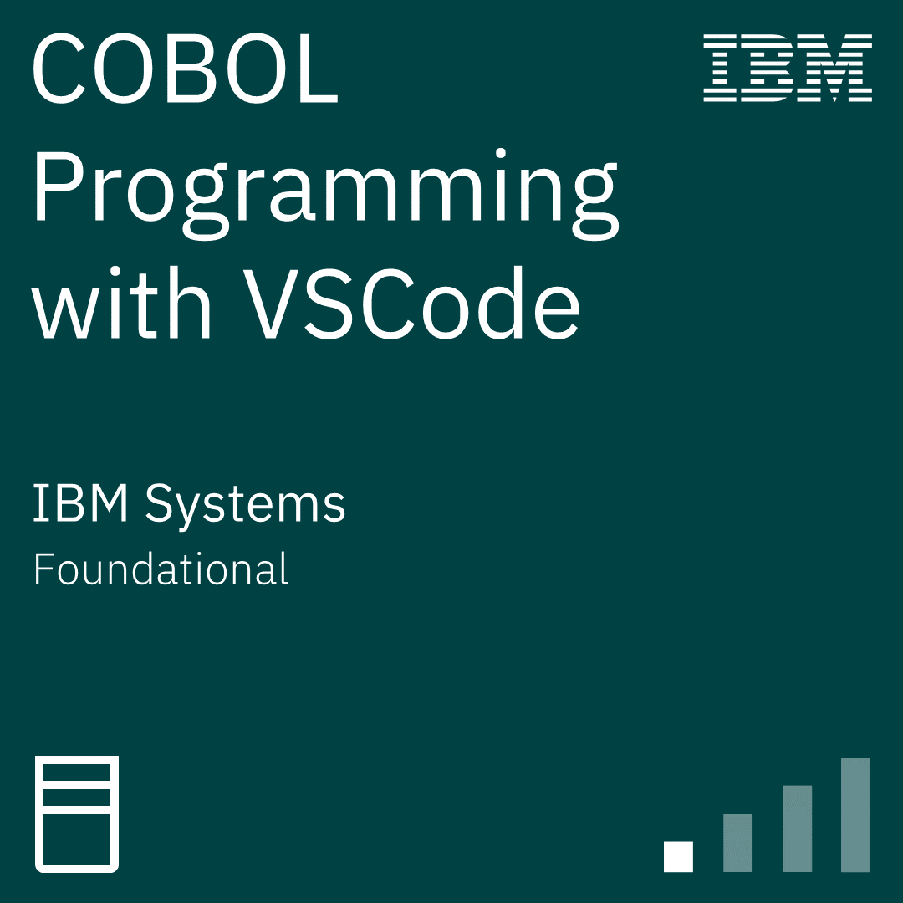
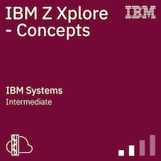
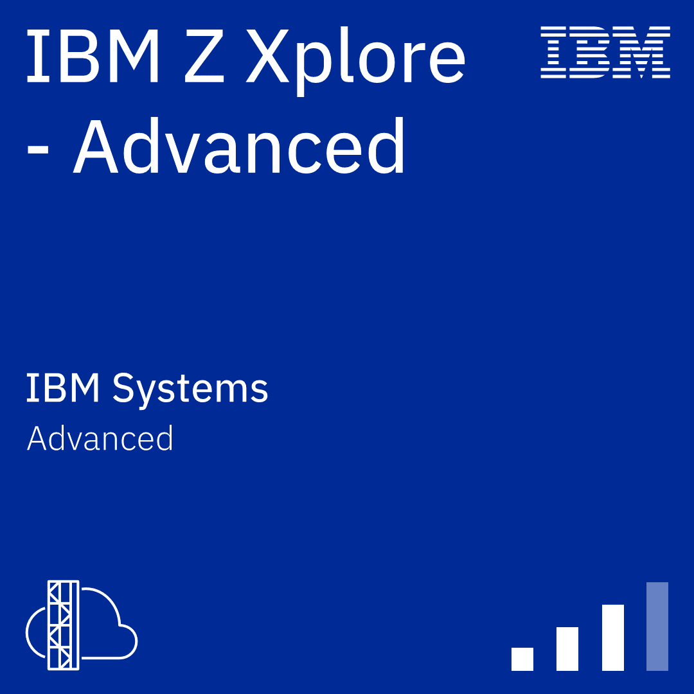

# Formation Mainframe 

## Formation technique

- <a href="https://ibmzxplore.influitive.com/channels/47">Accès IBM Z Explorer : pseudo Zxxxxx + mot de passe</a> 
- Accès IBM Z Explorer <a href="https://ibmzxplore.influitive.com/channels/1">"Fundamentals & concepts"</a>, <a href="https://ibmzxplore.influitive.com/channels/4">Advanced</a> et <a href="https://ibmzxplore.influitive.com/channels/44">Application Developer</a>. 
- <a href="https://www.ibm.com/docs/en/zos-basic-skills?topic=less-interactive-system-productivity-facility-ispf-courses">IBM ISPF / TSO</a>


- <a href="https://www.ibm.com/docs/en/cobol-zos/6.3?topic=appendixes-reserved-words">IBM documentation</a>


- Coursera <a href="https://www.coursera.org/learn/ibm-cobol-basics">Cobol Basics</a>, <a href="https://www.coursera.org/learn/ibm-cobol-core">Cobol Core</a> and <a href="https://www.coursera.org/professional-certificates/ibm-z-mainframe#courses">Mainframe Practitioner Professional</a>

- <a href="https://quizlet.com/user/dleurs/folders/info-banque">Carte de mémorisation Quizlet</a>

### Formations métier / fonctionnel liées aux contraintes banques

- <a href="https://www.udemy.com/course/anti-money-laundering-aml-kyc/learn/lecture/21415788#overview">Cours Udemy AML / KYC</a>
- <a href="https://www.udemy.com/course/basel-norms-basel-1-basel-2-basel-3-masterclass/learn/lecture/27362484#overview">Cours Udemy accords de Bâle</a> 

### Les programmes dans ce projet

1. Helloworld 
2. Faire des dépots et tenter de faire des retraits sur un compte bancaire **(variable / if)**
3. Calculer les mensualités d'un prêt immobilité **(for loop / opération + complexe)**
4. Évaluer le risque de fraude d'un client / KYC **(group item / tableau / trie)**
5. Valider les emails, les numéros de téléphones et la date de naissance **(traitement sur les strings et dates, gestion des erreurs)**
6. Todo app **(listing, recherche, enregistrement sur fichier, interactivité)**


### Installation des outils : 

```
brew install gnu-cobol
```
Pour certains programme, il est nécessaire d'utiliser VSCode et d'avoir accès à un mainframe X 
- IMB Z Open Editor
- Zowe Explorer
- Code4z

### Pour executer un programme localement
```
cobc -x calcul_pret_immo.cbl && ./calcul_pret_immo
```


### Badges
<a href="https://www.credly.com/badges/4a9ee56d-5ac2-4ba8-962a-65d030fa9ca2/public_url">
    
</a>

<a href="https://www.credly.com/badges/3c016329-6289-481d-b843-2aa584891e57/public_url">
  
</a>

<a href="https://www.credly.com/badges/9e1c64d6-e84f-4521-ad00-a2e0f16f3e58/public_url">
  
</a>